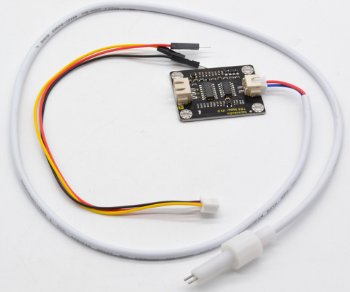
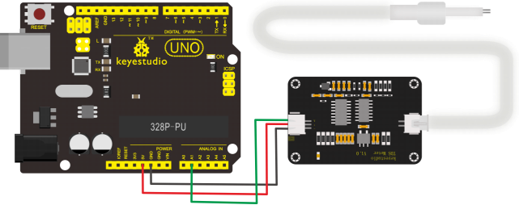
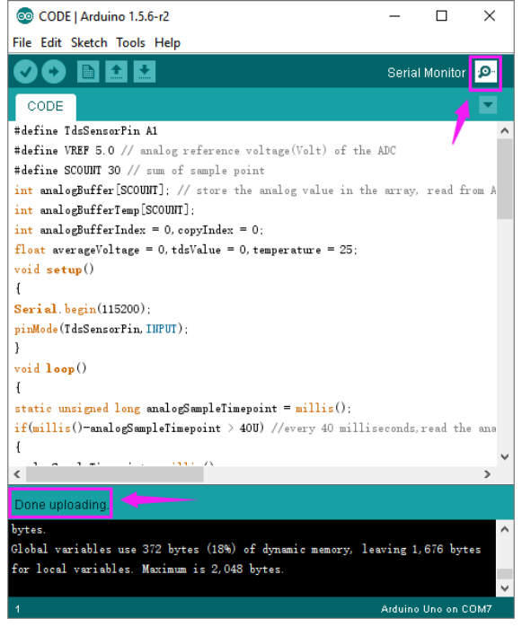
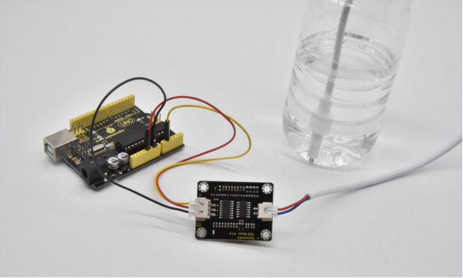
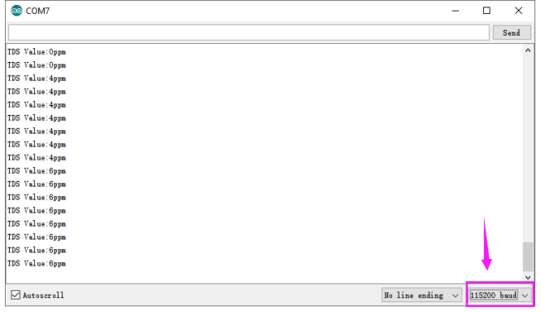

# KS0429 keyestudio TDS Meter V1.0



## 1. Description

Keyestudio TDS sensor kit is compatible with Arduino controllers, plug and play, easy to use.

It can be applied to measure TDS value of the water, to reflect the cleanliness of the water.

TDS (Total Dissolved Solids) indicates that how many milligrams of soluble solids dissolved in one liter of water. In general, the higher the TDS value, the more soluble solids dissolved in water, and the less clean the water is.

Therefore, the TDS value can be used as one of the references for reflecting the cleanliness of water
Measuring the TDS value in the water is to measure the total amount of various organic or inorganic substances dissolved in water, in the unit of ppm or milligrams per liter (mg/l).

Its Electrode can measure conductive materials, such as suspended solids, heavy metals and conductive ions in water.

The module comes with four 3.2mm fixed holes, easy to mount on any other devices.

## 2. Technical Parameters

**TDS Meter:**

- Input Voltage: DC 3.3 ~ 5.5V
- Output Voltage: 0 ~ 2.3V
- Working Current: 3 ~ 6mA
- TDS Measurement Range: 0 ~ 1000ppm
- TDS Measurement Accuracy: ± 10% F.S. (25 ℃)
- Module Interface: XH2.54-3P
- Electrode Interface: XH2.54-2P

**TDS Probe:**

- Number of Needle: 2
- Total Length: 60cm
- Connection Interface: XH2.54-2P
- Color: White
- Other: Waterproof Probe

## 3. Shipping List

- keyestudio TDS Meter V1.0 for Arduino x1
- Waterproof TDS Probe x1
- XH2.54-3Pin Jumper Wire x1



## 4. Test Code

Download code: [code](./code.7z)

```c
#define TdsSensorPin A1
#define VREF 5.0 // analog reference voltage(Volt) of the ADC
#define SCOUNT 30 // sum of sample point
int analogBuffer[SCOUNT]; // store the analog value in the array, read from ADC
int analogBufferTemp[SCOUNT];
int analogBufferIndex = 0,copyIndex = 0;
float averageVoltage = 0,tdsValue = 0,temperature = 25;

void setup()
{
    Serial.begin(115200);
    pinMode(TdsSensorPin,INPUT);
}

void loop()
{
    static unsigned long analogSampleTimepoint = millis();
    if(millis()-analogSampleTimepoint > 40U) //every 40 milliseconds,read the analog value from the ADC
    {
        analogSampleTimepoint = millis();
        analogBuffer[analogBufferIndex] = analogRead(TdsSensorPin); //read the analog value and store into the buffer
        analogBufferIndex++;
        if(analogBufferIndex == SCOUNT)
        analogBufferIndex = 0;
    }
    static unsigned long printTimepoint = millis();
    if(millis()-printTimepoint > 800U)
    {
        printTimepoint = millis();
        for(copyIndex=0;copyIndex<SCOUNT;copyIndex++)
        analogBufferTemp[copyIndex]= analogBuffer[copyIndex];
        averageVoltage = getMedianNum(analogBufferTemp,SCOUNT) * (float)VREF/ 1024.0; // read the analog value more stable by the median filtering algorithm, and convert to voltage value
        float compensationCoefficient=1.0+0.02*(temperature-25.0); //temperature compensation formula: fFinalResult(25^C) = fFinalResult(current)/(1.0+0.02*(fTP-25.0));
        float compensationVolatge=averageVoltage/compensationCoefficient; //temperature compensation
        tdsValue=(133.42*compensationVolatge*compensationVolatge*compensationVolatge - 255.86*compensationVolatge*compensationVolatge + 857.39*compensationVolatge)*0.5; //convert voltage value to tds value
        //Serial.print("voltage:");
        //Serial.print(averageVoltage,2);
        //Serial.print("V ");
        Serial.print("TDS Value:");
        Serial.print(tdsValue,0);
        Serial.println("ppm");
    }
}

int getMedianNum(int bArray[], int iFilterLen)
{
    int bTab[iFilterLen];
    for (byte i = 0; i<iFilterLen; i++)
    bTab[i] = bArray[i];
    int i, j, bTemp;
    for (j = 0; j < iFilterLen - 1; j++)
    {
        for (i = 0; i < iFilterLen - j - 1; i++)
        {
            if (bTab[i] > bTab[i + 1])
            {
                bTemp = bTab[i];
                bTab[i] = bTab[i + 1];
                bTab[i + 1] = bTemp;
            }
    	}
    }
    if ((iFilterLen & 1) > 0)
    bTemp = bTab[(iFilterLen - 1) / 2];
    else
    bTemp = (bTab[iFilterLen / 2] + bTab[iFilterLen / 2 - 1]) / 2;
    return bTemp;
}
```

## 5. Test Result

Done uploading the code, open the serial monitor and set the baud rate to 115200.



Place the TDS probe into water; it can measure the TDS value of the water and show the value on the monitor.



